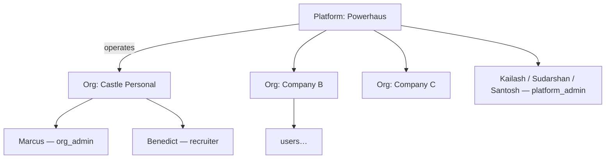

# Multi-Tenancy, Identity & Access Control — Foundation Plan

**Date:** 2026-07-20 · **Status:** design, awaiting approval (no code written yet)
**Target scale:** 100–200 client companies, thousands of users
**Trigger:** first enterprise client (Castle Personal — users Marcus + Benedict) onboarding alongside the 3 internal admins.

---

## 1. Where we actually stand

Better than expected. The identity plumbing was built correctly and left dormant; what is missing is **enforcement**, not architecture.

**Already done (no rework needed):**

| Capability | Where | State |
|---|---|---|
| Auth0 RS256 verification, alg pinning, global router dependency | `app/security/jwt_verifier.py` | Solid |
| `Principal` with `sub`, `email`, `tenant_id`, `roles` | [deps.py:29-48](../../BE/app/security/deps.py#L29-L48) | Done |
| **`tenant_id` read from the TOKEN, never from body/header** | [deps.py:63-83](../../BE/app/security/deps.py#L63-L83) | Done — the one thing that's hard to retrofit |
| `require_roles(*roles)` dependency factory | [deps.py:136](../../BE/app/security/deps.py#L136) | Written, **unused** |
| Just-in-time user provisioning, unique `auth0Sub` | `app/services/user_service.py` | Done |
| `users` carries `tenantId` + `roles`, indexed | [user_service.py:92-97](../../BE/app/services/user_service.py#L92-L97) | Done |
| BFF session (httpOnly cookie, token never in browser) | `UI/lib/api.ts` | Done |

The `principal_from_claims` docstring already anticipates this exact moment:
> *"Today the post-login Action stamps `default` for everyone; when Organizations are switched on it stamps the real org and this code is unchanged."*

**The gap — this is the whole project:**

- **74 endpoints** across 12 API modules; only **2 files** reference `Principal`/`require_auth` at all.
- `tenant_id` is `"default"` for every user, so even if queries were scoped, everyone shares one tenant.
- **12+ collections carry no tenant key:** `candidates`, `candidatePipelines`, `cv_candidates`, `cv_files`, `match_runs`, `qa_reports`, `parsed_jds`, `jobs`, `companies`, `prospects`, `icpConfig`, `runs`, `chatThreads`, `chatMessages`. (`outreach_messages`/`outreach_events` already have `tenantId` — the only collections that do.)
- Net effect today: **any authenticated user can read the entire database**, including scraped candidate PII belonging to any client.

---

## 2. The identity model

Three tiers. Keep them strictly separate — conflating "our staff" with "customer admin" is the most common way this design rots.



### Roles

| Role | Who | Scope | Can |
|---|---|---|---|
| `platform_admin` | Kailash, Sudarshan, Santosh | **Cross-tenant** | Support access to any org, per-user run history, usage/billing, provision orgs. Every cross-tenant read is **audit-logged** (break-glass, not silent). |
| `org_admin` | Client owner (Marcus) | One org | Everything in their org + invite/deactivate their users, see org usage. |
| `recruiter` | Client user (Benedict) | One org | Full product use; sees org-shared data. |
| `viewer` | optional, later | One org | Read-only. |

**Recommendation:** `platform_admin` is granted by Auth0 role **and** cross-checked against a short server-side allowlist of the 3 subs/emails. Two independent conditions means a misconfigured Auth0 role alone cannot mint a super-user.

### Visibility rule (the core semantic you described)

> **Default visibility is the ORGANIZATION, not the individual.**

- Marcus and Benedict **both see** all runs, leads and candidates created inside Castle Personal — symmetric, no per-user walls. This is what you asked for and it is also the right default: recruiters cover for each other.
- Every record still stamps **`ownerId`** (the creating user's `sub`) so "who ran this" is always answerable — that powers per-user history views and the admin drill-down.
- **Across organizations: nothing, ever.** Company B cannot see Castle Personal in any view, count, search, or export.
- Your own runs are invisible to clients automatically — they live in the internal `powerhaus` org, a different tenant. This falls out of the model rather than needing a special case.

*Decision to confirm:* if you later want a "private run" (visible only to its owner within an org), add a `visibility: "org" | "private"` field now while it's free. I recommend adding the field, defaulting to `"org"`, and not building UI for it yet.

---

## 3. Where tenant identity comes from — Auth0 Organizations

**Recommendation: enable Auth0 Organizations, one Auth0 Org per client company.**

Why this and not a `tenantId` column we manage ourselves:
- The tenant claim arrives **inside the signed token**. A client-supplied tenant is just a request to read someone else's data — and `principal_from_claims` already refuses to read it from anywhere else.
- Org-level login screens, invitations, and SSO (enterprise clients will ask for SAML/Entra within a year) come for free.
- **`app/security/deps.py` needs no change** — only the Auth0 post-login Action changes, to stamp the real `org_id` and roles into the namespaced claims.

Work required: create the Auth0 Org per client, a post-login Action stamping `{ns}tenant_id` + `{ns}roles`, and an org-selection step for any user who belongs to more than one org (agencies — rare, but design for it now: model membership as a **list**, even if the token carries one active org per session).

*Decision to confirm:* can one person belong to two client companies? I recommend modelling `memberships[]` in the DB from day one, while keeping exactly one **active** org per session.

---

## 4. Data model

Every tenant-owned document gets three fields, written by the data layer (never by hand):

```jsonc
{
  "tenantId": "org_castle_personal",   // REQUIRED. Leading key of every index.
  "ownerId":  "auth0|abc123",          // who created it — attribution + audit
  "visibility": "org",                 // "org" (default) | "private"
  // …existing fields
}
```

**Indexing rule — this is what makes 200 orgs cheap:** `tenantId` becomes the **leading field of every index** on tenant-owned collections. Existing indexes get rebuilt as compound, e.g.:

- `match_runs`: `{tenantId:1, createdAt:-1}`, `{tenantId:1, ownerId:1, createdAt:-1}`
- `cv_candidates`: `{tenantId:1, contentHash:1}` **unique** (note: the current unique index is global on `contentHash` — two clients uploading the same CV would collide today; this **must** change or client B's upload silently returns client A's record)
- `candidates`: `{tenantId:1, pipelineId:1, apolloId:1}` unique

That `contentHash` finding is a concrete, live correctness bug the moment a second client exists — not a theoretical one.

**Deny by default:** a document with no `tenantId` is invisible to everyone except `platform_admin`. Absence is never treated as "belongs to me".

---

## 5. Enforcement: secure by construction, not by discipline

This is the most important recommendation in the document.

With **74 endpoints**, a rule that says *"remember to add `{"tenantId": principal.tenant_id}` to every query"* will hold for a few months and then leak — one forgotten filter in one endpoint exposes another client's candidate PII. Human discipline is the wrong control for a 74-surface problem.

**Build a scoped data-access layer and make the raw handle unreachable.**

```python
# app/security/scoped_db.py  (sketch)
class ScopedCollection:
    """Every read is filtered by tenant; every write is stamped with it."""
    def find(self, filt=None, *a, **kw):        # injects tenantId
    def find_one(self, filt=None, *a, **kw):    # injects tenantId
    def count_documents(self, filt=None):       # injects tenantId
    def aggregate(self, pipeline):              # prepends a $match on tenantId
    async def insert_one(self, doc):            # stamps tenantId + ownerId + createdAt
    async def update_one(self, filt, upd):      # injects tenantId into the filter

def get_scoped_db(principal=Depends(require_auth), db=Depends(get_database)) -> ScopedDb: ...
```

Endpoints then take `db = Depends(get_scoped_db)` and **cannot** express a cross-tenant query. `platform_admin` obtains a raw handle only through an explicit, separately-named dependency that writes an audit event.

**Backstop it with a test that fails CI**, in the spirit of the existing `test_api_protected.py` (which already asserts every route 401s without a token):
- a guard test asserting no module under `app/api/` references a tenant-owned collection directly;
- a test that iterates the live route table and asserts each route depends on `get_scoped_db` or is explicitly allowlisted.

That converts "did we remember?" into "the build fails".

---

## 6. Non-obvious leak vectors (found in the code — these bite hardest)

Endpoint scoping alone is **not sufficient**. The matching pipeline reads collections directly, below the API layer:

1. **`MongoVectorStore.query` scans every CV in the database** ([vector_store.py](../../BE/app/services/vector_store.py)) — filter is `{"status": "embedded"}` only. Without a tenant filter, Castle Personal's job description would retrieve Company B's CVs. **Highest-severity leak in the system.**
2. **Atlas `$vectorSearch` filter** (FC-39) declares only `status` as a filter field. `tenantId` must be added to the vector index definition **and the index rebuilt** — an index change with a build delay, so schedule it.
3. **The BM25 lexical corpus** is rebuilt per query by streaming *every* `cv_candidates` doc ([matching_service.py](../../BE/app/services/matching_service.py)) — same leak, same fix.
4. **QA auditor + evidence pool** inherit the scorer's corpus by design — they leak if retrieval leaks.
5. **`profileEnrichmentCache`** is keyed by LinkedIn identifier globally. Cross-tenant cache *hits* are arguably desirable (cost saving) but mean Company B's enrichment spend can be triggered by Company A's search. Decide deliberately; I recommend keeping the cache shared but attributing cost to the tenant that caused the fetch.
6. **`cost_service`** context-var attribution must carry `tenantId`, or per-client billing and quotas are impossible later.

---

## 7. Audit trail

You asked to see run history per user as an admin. Two layers:

- **Attribution (already implied by `ownerId`)** — every run/pipeline/upload answers "who".
- **`audit_events` (new, append-only):** `{tenantId, actorId, action, resourceType, resourceId, at, ip, userAgent}`. Records logins, cross-tenant admin access, role changes, deletions, exports.

This is not optional bureaucracy: it is required for the GDPR/EU-AI-Act posture already flagged in `AUDIT_CANDIDATE_PIPELINE.md` (recruitment ranking is Annex III high-risk; logging and human-oversight obligations phase in from Aug 2026), and it is the only way to answer a client asking "who looked at our candidates?".

---

## 8. Migration & rollout (zero-downtime)

1. **Backfill** all existing documents with `tenantId: "powerhaus_internal"` + best-known `ownerId`. Everything you've built so far becomes internal-tenant data — clients never see it.
2. **Dual-read window:** scoped layer treats missing `tenantId` as internal-tenant-only while the backfill completes.
3. **Build new indexes first**, then drop the old global ones (notably the `contentHash` unique index).
4. **Flip `tenant_id`** in the Auth0 Action from `default` to the real org.
5. **Verify with a red-team test:** log in as Marcus, assert every list endpoint returns zero Company-B records; log in as a Company-B user and assert the reverse. Automate this as a permanent test.

---

## 9. Phased roadmap

| Phase | Scope | Outcome |
|---|---|---|
| **0 — Foundation** *(start now)* | Tenant/role model, Auth0 Organizations + Action, `ScopedDb` layer, `tenantId`/`ownerId` schema + indexes, backfill, CI guard tests | Isolation exists and is enforced structurally. No feature change. |
| **1 — Enforcement** | Migrate all 74 endpoints onto `ScopedDb`; **fix the retrieval leaks (§6)**; per-user + per-org run history views | Castle Personal can be onboarded safely. |
| **2 — Client self-service** | `org_admin` UI: invite/deactivate users, roles; org usage dashboard (runs, leads, candidates) | Marcus manages Benedict without you. |
| **3 — Scale & governance** | Per-tenant quotas & cost attribution, rate limits, `audit_events` UI, DSAR/retention per tenant | Ready for 100–200 orgs and EU client scrutiny. |

Phase 0 + 1 are the ones that must land **before** Castle Personal gets logins. Phases 2–3 can follow.

---

## 10. Decisions I need from you

1. **Auth0 Organizations** — confirm we enable it (vs. a self-managed tenant claim). *Recommended: yes.*
2. **Multi-org users** — can one person belong to two client companies? *Recommended: model `memberships[]` now, one active org per session.*
3. **Private runs** — add the `visibility` field now (default `"org"`), UI later? *Recommended: yes, add the field.*
4. **`isActive` enforcement** — today a deactivated user still passes auth (the flag exists but is never checked). Confirm we block deactivated users at `require_auth`. *Recommended: yes — this is a small fix with real consequence.*
5. **Enrichment cache sharing** — shared across tenants (cheaper) with per-tenant cost attribution, or hard-isolated? *Recommended: shared + attributed.*

---

## 11. What I'd flag as risk

- **The `contentHash` unique index is a live bug** the moment client #2 uploads a CV that client #1 already uploaded — the second upload is silently treated as a duplicate and returns the first client's record. Must be fixed in Phase 0.
- **Retrieval-layer leaks (§6) are invisible to endpoint-level review.** A tenancy audit that only reads `app/api/` will pass while the matcher still reads every CV in the database.
- **Don't ship "tenant scoping" incrementally across endpoints without the structural layer.** Partial scoping produces a false sense of safety that is worse than none, because it stops anyone looking.
